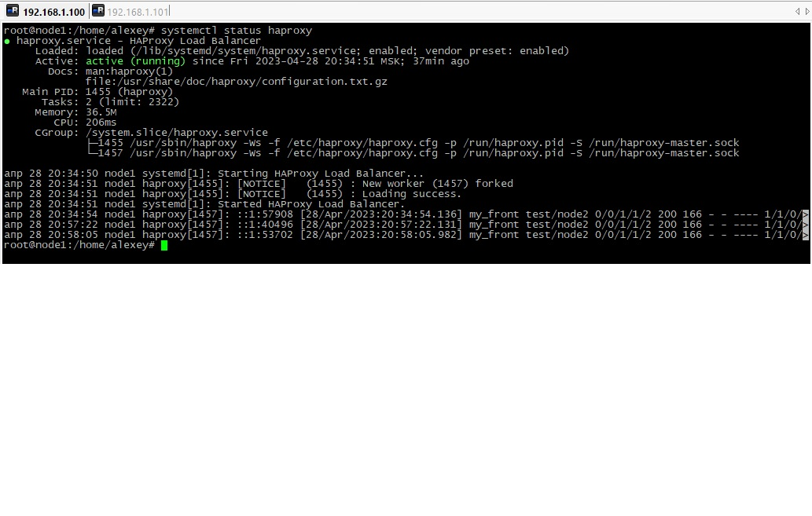
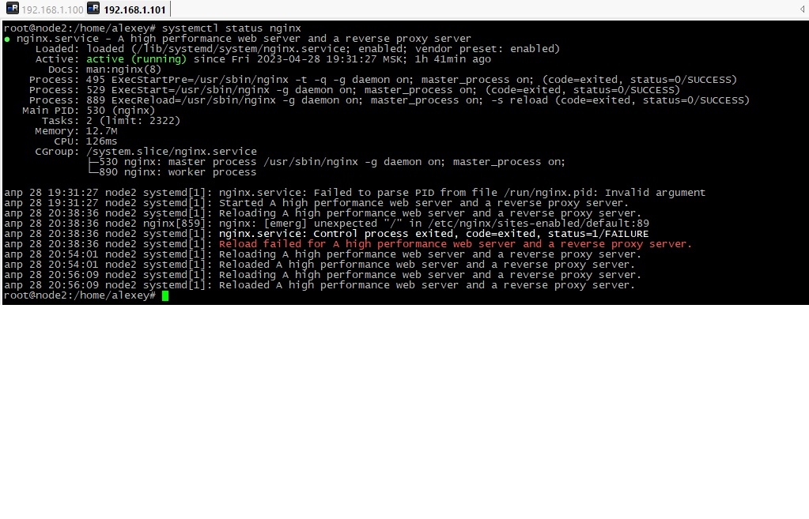
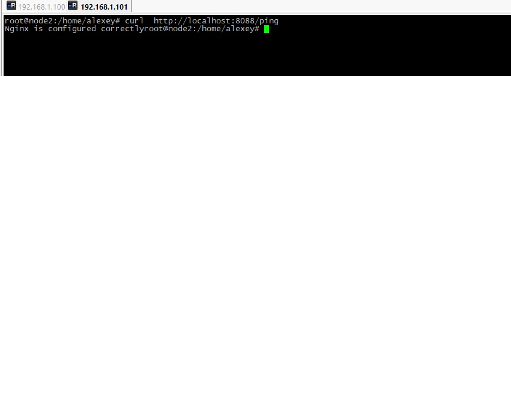
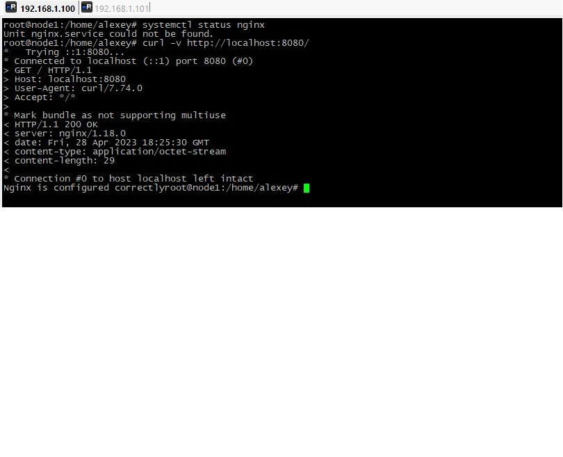

# Домашнее задание к занятию "`10.5 «Балансировка нагрузки. HAProxy/Nginx»" - `Дьяконов Алексей`

### Задание 1. Что такое балансировка нагрузки и зачем она нужна?.

` Балансировка нагрузки  - процесс распределения нагрузки на пул серверов. Она нужна для распределения нагрузки между серверами, что уменьшит нагрузку на каждый хост и, соотвественно, увеличивает скорость обработки информации, увеличивает отказоустойчивость, позволяет более эффективно использовать имеющиеся серверные мощности`

### Задание 2. Чем отличаются алгоритмы балансировки Round Robin и Weighted Round Robin? В каких случаях каждый из них лучше применять?.

`Round Robin - алгоритм балансировки, при котором  балансировщик перенаправляет запросы серверам просто по порядку, а при Weighted Round Robin - в зависимости от приоритета(веса) сервера. Round Robin лучше применять в случае, когда сервера имеют равную мощность, а Weighted Round Robin - при наличиии серверов разной мощности(на более мощный сервер будет отправляться больше запросов)`


  

### Задание 3. Установите и запустите Haproxy(Debian 11 и Haproxy 2.6).

1. `Добавляем репозиторий и GPG-ключ`

```
    curl https://haproxy.debian.net/bernat.debian.org.gpg \
    | gpg --dearmor > /usr/share/keyrings/haproxy.debian.net.gpg

    echo deb "[signed-by=/usr/share/keyrings/haproxy.debian.net.gpg]" \
    http://haproxy.debian.net bullseye-backports-2.6 main \
    > /etc/apt/sources.list.d/haproxy.list
```
2. `Обновляем кэш apt`

    apt update

3. `Устанавливаем пакет`

    apt install haproxy=2.6.\*

4. `Запускаем сервис`

```
    systemctl start haproxy

    systemctl enable haproxy

    systemctl status haproxy
```


-


### Задание 4. Установите и запустите Nginx.

1. `Обновляем кэш apt`

    apt update

2. `Ставим пакет `

    apt install nginx

3. `Запускаем сервис`

```
    systemctl start  nginx

    systemctl enable  nginx

    systemctl status nginx
```

4. `Проверяем конфиг на ошибки `

    sudo nginx -t

-

    

### Задание 5. Настроить Nginx.

1. `Правим файл /etc/nginx/sites-enabled/default`

```
    server {
            listen 8088;
            listen [::]:8088;
            location /ping {
                    return 200 "Nginx is configured correctly';

            }
    }
```

2. `Проверяем`

    sudo nginx -t

3. `Перезагружаем сервис `

    systemctl reload nginx

-

### Задание 6. Настроить Haproxy.

1. `Правим конфигурационный файл`

```
    nano /etc/haproxy/haproxy.cfg


    frontend my_front

        bind :::8080
        mode http
        default_backend test

    backend test

        mode http
        acl p_root path -i /
        http-request set-path /ping if p_root
        server node2 192.168.1.101:8088
```

-